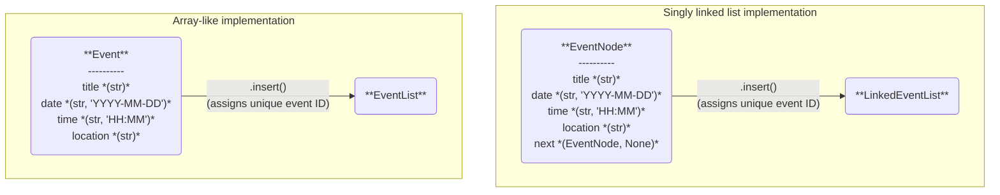

# event-scheduler
CU Boulder DTSC 5501 Fall 2025 Group Project #1: Campus Event Scheduling System

## Roles & Responsibilities
Written and maintained by Group 10. The group collaborated on every part of the project but each collaborator assumed lead roles in particular project components:
- **Stephanie Bie**: General prototyping & packaging, git & changelog maintenance, readme writeup, sorting algorithms implementation, unit testing
- **Dnyanada Bhosale**: Search algorithms implementation, performance analysis
- **Augustine Joy**: Event classes implementation, performance analysis

## Install

Open a new terminal, navigate to a preferred directory, and clone the repository onto your local machine (for more information see this <a href="https://docs.github.com/en/get-started/git-basics/about-remote-repositories">tutorial</a>. I recommend following the "Cloning with SSH URLs" section):

```bash
git clone git@github.com:stephaniebie/event-scheduler.git
```

Create and enter a virtual environment (Windows):

```bash
python -m venv venv
source venv/Scripts/activate
```

### For Developers

Once in the environment, install the package in editable mode:

```bash
pip install -e .[dev]
```

### For Users

Once in the environment, install the package:

```bash
pip install .
```

### For use with Jupyter

Install a kernel for use with Jupyter notebooks:

```bash
python -m ipykernel install --user --name=scheduler
```

## Development

<b>NOTE FOR COLLABORATORS: Please don't delete docstrings!!! (And please write them when they're missing!!)</b>

Navigate to the directory the local repo is located in, and open a terminal at this location.

For all developers, I recommend creating a new branch using the following command:

```bash
git checkout -b your-branch-name
```

<b>IMPORTANT: It is generally bad practice to push to a main branch, especially in a collaborative environment!! Please please please make a new branch and create a pull request.</b>

Enter the virtual environment created earlier:

```bash
source venv/Scripts/activate
```

To open VSCode (if you haven't already, please install from <a href="https://code.visualstudio.com/download">here</a>):

```bash
code .
```

To open Jupyter Lab:

```bash
jupyter-lab .
```

To run tests:

```bash
pytest tests
```

After making a change you'd like to commit, run the following commands:

```bash
# This stages all of your recent changes
git add -A
# This commits your changes and allows you to write a message summarizing the change. It is good practice to write a message
git commit -m "Commit message here"
# This pushes your changes to the remote repository
git push
```

NOTE: if this is a new branch you may need to run

```bash
git push --set-upstream origin your-branch-name
```

To exit and close the notebook, open the terminal where you ran the above command, and press `Ctrl+C` a few times.

To exit the virtual environment, type `deactivate` in the terminal.

## Setup

### Design Philosophy

The `scheduler` package is an object-oriented approach to constructing a non-conflicting series of uniform objects in time. The primary use case of this package is to create, insert, and access a collection of campus events.



The user has a choice of two list-like data structures for storing events: an `EventList` or a `LinkedEventList`. The first data structure emulates the Java ArrayList data structure where the list is initialized as a static array of a specified capacity. As events are appended exceeding capacity, a dynamic resizing will occur (which is the principle behind a dynamic array). Accordingly, as the name implies, the `LinkedEventList` is a singly linked list approach to storing items where individual event nodes are connected to one other node. Out of convenience, both structures support iterator, setter, and getter functionality. However, it is important to note, directly accessing events within the lists using these methods does not automatically trigger a conflict detection.

Naturally, one may question where the two list data structures differ since data access within the list has been generalized. The key lies within the getter and setter implementations. Within `EventList`, we take advantage of the built-in Python list indexing and slicing, which has O(1) time complexity. In `LinkedEventList`, accessing and setting values is at least O(N) as each index into the list requires walking through each EventNode.

Each event is represented by an `Event` or `EventNode` class. The parent `Event` class takes four required parameter inputs: `title` (string), `date` (string, formatted as "YYYY-MM-DD"), `time` (string, formatted as "HH:MM"), and `location` (string). All events also have an `id` property that is set per instance of an Event object per insertion within an event list. The `EventNode` class inherits from the `Event` class and introduces an additional attribute: `next` (None or `EventNode` type). This additional parameter opens up the Event objects for use with linked lists.

Two events are considered equal if all attributes are equivalent (excluding `next`). Accordingly, event conflict detection is done by checking if two events overlap only in date and time. There is no consideration for the location or of events of different lengths. We have left this as a feature for the future of this package.

The philosophy behind designing the `EventList` and `LinkedEventList` classes as iterators is to allow for generalizing the sorting and searching algorithms. Both categories of algorithms apply to any iterable object that supports setting and getting elements in the iterator.

## Results
# TODO
